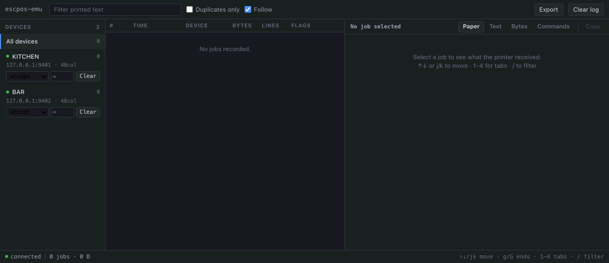

# escpos-emu

[](https://nodejs.org)
[](package.json)
[](LICENSE)

A multi-IP ESC/POS thermal printer emulator with a live paper feed, searchable
history and failure injection. Test receipt and kitchen-ticket printing without
hardware.

- **Several printers, each on its own IP**, so routing-by-address is exercised
  for real instead of collapsed onto one loopback port.
- **A real ESC/POS interpreter** — alignment, emphasis, character size, code
  pages, cut, drawer kick, barcodes, QR, raster logos. Not a byte-stripper.
- **Duplicate detection**, which is the reason this exists.
- **Failure injection at runtime** — make a printer hang, refuse, or run out of
  paper while your stack is running.
- **Zero runtime dependencies.** Node 18+, clone and go.
- **Your application can be in any language.** Printers are raw TCP and the
  control API is HTTP — Node is what the emulator is written in, not what you
  have to test from.

**Documentation** — [Setup](docs/SETUP.md) (IP addresses, Docker, CI,
troubleshooting) · [ESC/POS coverage](docs/COMMANDS.md) (what is modelled, and
how to add a command)



Every job is a row. `DUP` is the same ticket printed twice, `WIDE` is a line
that does not fit the roll, `?CMD` is a command this build does not model.
Select a row to see the rendered paper — under a column ruler, so the edge of
the roll is where you can see it — the plain text, a hex dump with the command
introducers highlighted, or the decoded command stream.

| key | |
| :-- | :-- |
| `↑` `↓` or `j` `k` | move through jobs |
| `g` / `G` | first / last |
| `1`–`4` | Paper, Text, Bytes, Commands |
| `/` | filter; `Esc` clears it |

**Follow** keeps the newest job selected, which is the mode you want while
driving the system under test from another window.

## Why

Printing is usually tested by standing next to a printer. So it is the part of a
system that breaks quietly.

The failures are all invisible from the sending side. A job printed twice looks
exactly like a job printed once. A job that never came out looks the same as one
that did, because the socket accepted it. A printer that is out of paper accepts
your bytes and drops them, and a printer that has hung accepts the connection and
then says nothing at all — so code written against "it works" and "it is missing"
passes, and the third case is the one that stops everything.

None of that is visible in your own logs, because nothing in them knows what the
printer actually received. This is the thing that does, and the assertion it
makes possible is one line:

```js
await emu.expectExactlyOne('3 x CAPPUCCINO', { device: 'kitchen' });
```

## Install

```bash
npm install --save-dev escpos-emu
# or run it straight from the repo
npx escpos-emu --config devices.json
```

## Quickstart

```bash
git clone https://github.com/drk1rd/escpos-emu && cd escpos-emu

# Three printers on 127.0.0.1, no setup needed
npx escpos-emu --config devices.loopback.json

# In another shell — send some paper to look at
node examples/send-demo.js
```

Open <http://localhost:7070>.

## Printers on their real addresses

The point of emulating `192.168.10.101` rather than `127.0.0.1:9101` is that
your restored production data works **unedited** and your routing code is
genuinely exercised.

**Under Docker** (recommended):

```bash
docker compose up --build
```

**On the machine directly**, the addresses have to exist first — see
[Setup](docs/SETUP.md) for macOS, Linux, WSL and Windows:

```bash
./scripts/aliases.sh up devices.json   # prints the commands; read them, then run them
npx escpos-emu --config devices.json
./scripts/aliases.sh down devices.json # when you are done
```

> **A warning the tool also enforces.** If this machine is already on the subnet
> you are emulating, claiming those addresses means real traffic comes here
> instead of to the real devices, and they silently stop printing.
> `escpos-emu` refuses to start in that case and names the interface. Override
> with `--allow-subnet-conflict` only when you are certain.

## Configuration

```json
{
  "subnet": "192.168.10.0/24",
  "httpPort": 7070,
  "dataDir": "./data",
  "duplicateWindowMs": 300000,
  "devices": [
    {
      "id": "kitchen",
      "name": "KITCHEN",
      "ip": "192.168.10.101",
      "port": 9100,
      "columns": 48,
      "page": "CP437",
      "mode": "accept"
    }
  ]
}
```

| field | meaning |
| :-- | :-- |
| `columns` | characters per line — 48 is an 80mm roll, 32 is 58mm. Lines wider than this are flagged. |
| `page` | starting code page, as hardware would have been left by the last job |
| `mode` | `accept`, `reset`, `hang` or `refuse` |
| `paper` | sheets before it runs out; omit for an endless roll |
| `throttleBps` | drain the socket slowly, like a real head |
| `idleFlushMs` | close a job after this long without new bytes (default 1000; for clients that keep the connection open) |
| `subnet` | the CIDR the devices live in, used by the conflict check. `null` disables it. |

## Failure modes

Named after the failures, not the implementation:

| mode | what the client sees |
| :-- | :-- |
| `accept` | a working printer: takes the bytes, records them |
| `reset` | accepts, then drops — paper-out on some firmware (`ECONNRESET`) |
| `hang` | accepts and never reads or closes. **The one that finds bugs**: a print path without a timeout waits for ever |
| `refuse` | powered off (`ECONNREFUSED`) |

Flip any of them from the UI, or:

```js
await emu.setMode('kitchen', 'hang');
```

## Using it from tests

```js
const { Client } = require('escpos-emu');
const emu = new Client('http://localhost:7070');

beforeEach(() => emu.reset());

test('a round is sent to the kitchen exactly once', async () => {
  await placeOrder({ table: 'B4', items: ['CAPPUCCINO x3'] });

  await emu.expectExactlyOne('3 x CAPPUCCINO', { device: 'kitchen' });

  // and nowhere else
  expect(await emu.count({ device: 'bar' })).toBe(0);
});

test('a ticket that fails to print is not reported as sent', async () => {
  await emu.setMode('kitchen', 'hang');
  await placeOrder({ table: 'B4', items: ['CAPPUCCINO x3'] });

  expect(await emu.count({ device: 'kitchen' })).toBe(0);
  expect(await orderStatus('B4')).toBe('print-failed');
});
```

| method | |
| :-- | :-- |
| `jobs({ device, q, duplicatesOnly, limit })` | jobs, newest last |
| `job(id)` | one job in full, including raw bytes |
| `jobsContaining(text, { device })` | search printed text |
| `count({ device })` | how many |
| `waitForJob(text, { device, timeoutMs })` | printing is asynchronous |
| `expectExactlyOne(text, { device })` | throws, listing every match and its time |
| `setMode(device, mode)` / `setPaper(device, sheets)` | failure injection |
| `reset(device?)` | clear the log |

### From another language

The emulator is a daemon, not a library. Printers are raw TCP on port 9100 and
the control API is HTTP with JSON, so the client above is a convenience for Node
suites rather than a requirement. From Python, for instance:

```python
import requests

EMU = "http://localhost:7070"

def reset():
    requests.post(f"{EMU}/api/reset").raise_for_status()

def jobs(text=None, device=None):
    path = f"/api/devices/{device}/jobs" if device else "/api/jobs"
    r = requests.get(EMU + path, params={"q": text} if text else None)
    return r.json()["jobs"]

def set_mode(device, mode):          # accept | reset | hang | refuse
    requests.post(f"{EMU}/api/devices/{device}/mode", json={"mode": mode})

def test_round_reaches_the_kitchen_once():
    reset()
    place_order(table="B4", items=["CAPPUCCINO x3"])
    matches = jobs("3 x CAPPUCCINO", device="kitchen")
    assert len(matches) == 1, [j["at"] for j in matches]
```

Printing is asynchronous, so poll rather than reading immediately — that is all
`waitForJob` does.

### Duplicate detection

Two duplicate tickets are **not identical byte for byte** — the printed clock
differs — so hashing the bytes finds nothing. `escpos-emu` hashes the *layout*:
the rendered text with dates and times masked. Two prints of the same round
match; two genuine rounds of the same drink do not.

Both mistakes give a number nobody can act on. Hashing the bytes reports no
duplicates at all; comparing item names calls every repeated order a duplicate.

## HTTP API

```
GET  /api/devices                     list, mode, counts
GET  /api/devices/:id/jobs            ?since= ?q= ?duplicatesOnly= ?limit=
GET  /api/jobs/:id                    one job, with bytes
GET  /api/stream                      SSE: job, mode, drawer, paperOut
GET  /api/stats
GET  /api/export?format=jsonl|csv
POST /api/devices/:id/mode   {mode}
POST /api/devices/:id/paper  {sheets}
POST /api/devices/:id/reset
POST /api/reset
```

## The job log

Append-only JSONL at `<dataDir>/jobs.jsonl` — greppable and `tail`-able when the
UI is not up, and it survives a restart. Each job records the raw bytes, the
decoded text, the rendered lines with their styling, every command event, the
code pages used, and which lines were too wide for the roll.

Use `--no-data` to keep everything in memory, which is what you want in CI.

## Embedding

```js
const { createEmulator } = require('escpos-emu');

const emu = createEmulator({
  subnet: null,
  dataDir: null,
  devices: [{ id: 'kitchen', ip: '127.0.0.1', port: 0, columns: 48 }],
});

const { url } = await emu.start({ httpPort: 0 });
// ... drive your system under test ...
await emu.stop();
```

`port: 0` and `httpPort: 0` take any free port, so a suite never guesses.

## Development

```bash
npm test          # node's own test runner, no framework
```

## Licence

MIT
